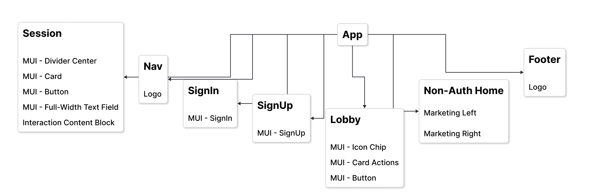
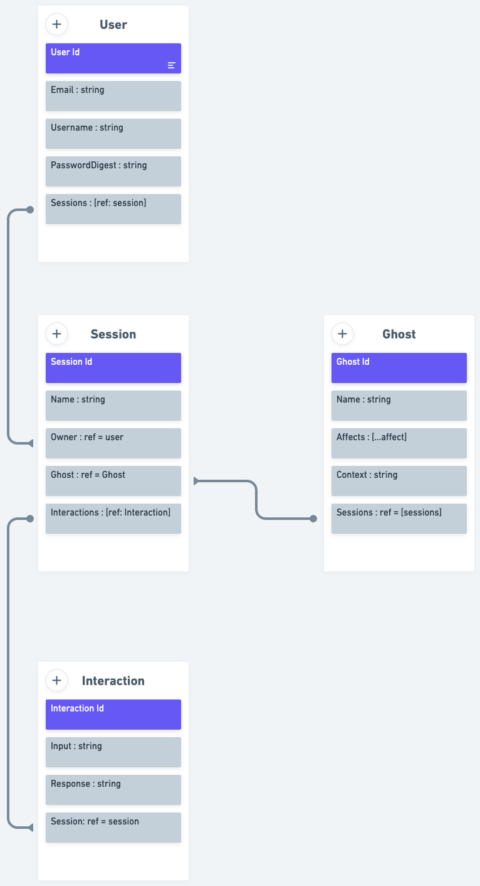
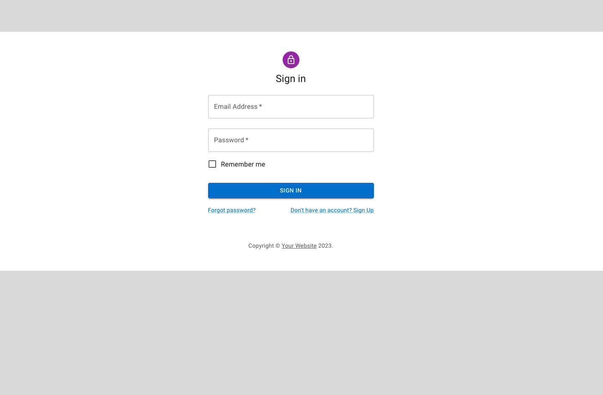
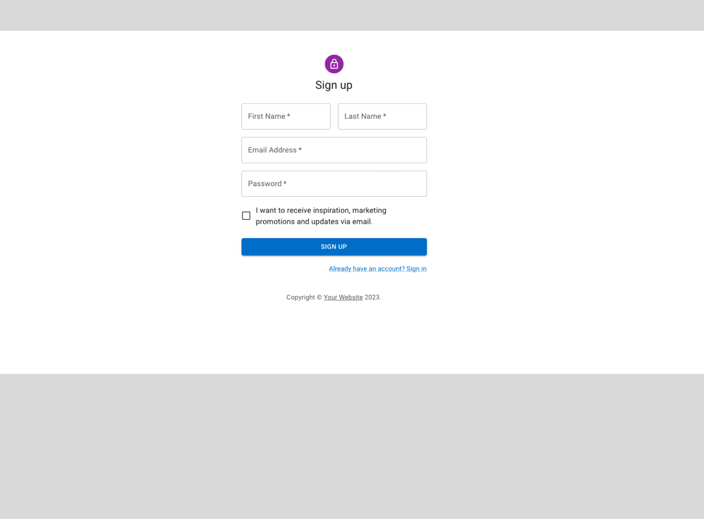
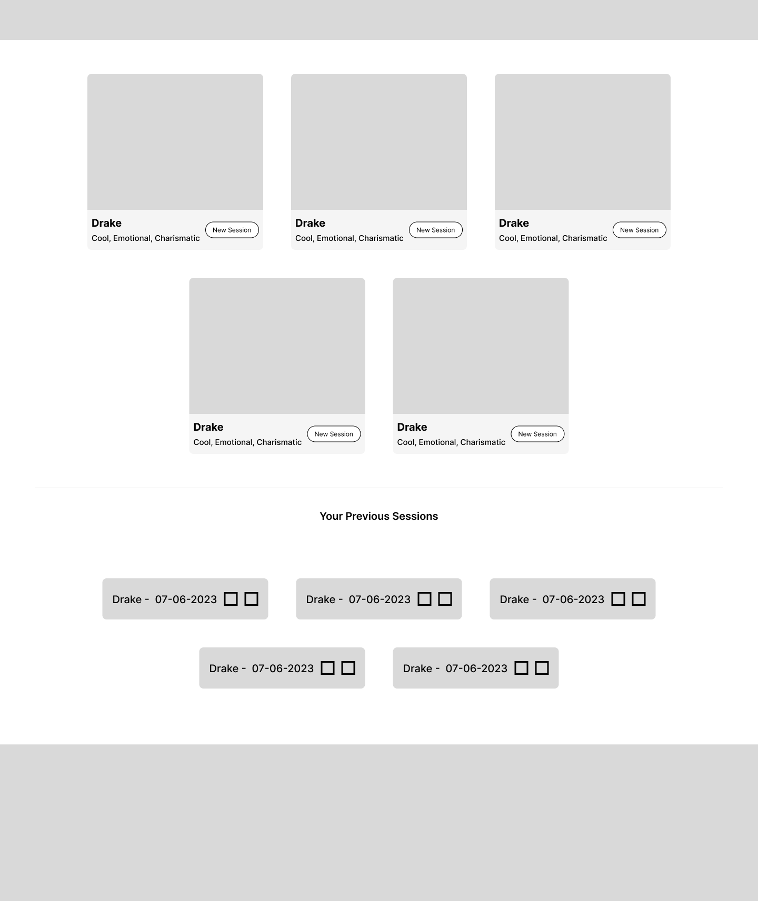
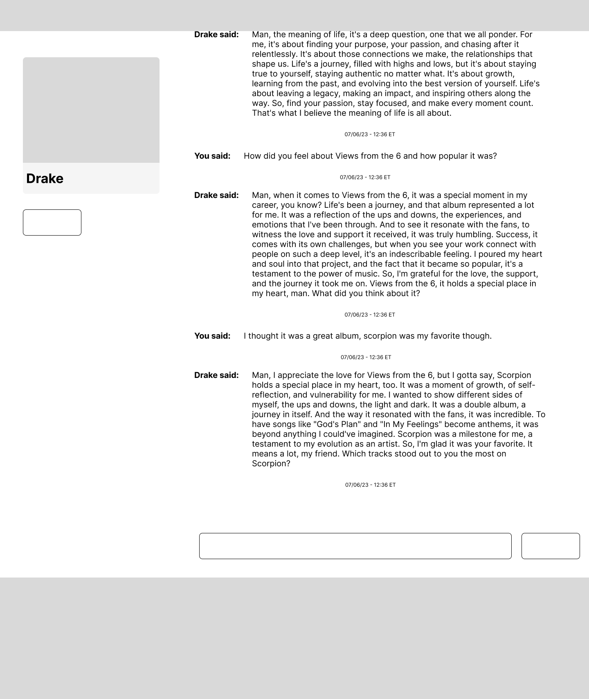

# Chattus Ex Machina

## Date: 07/07/2023

### By: Anthony Medina

[Live Site](http://chemchat.surge.sh/) | [GitHub](https://github.com/ajm24027) | [LinkedIn](https://www.linkedin.com/in/anthonyjmedina/) | [Trello](https://trello.com/b/WKPfCzCs/chem) | [Portfolio](https://www.anthonyjmedina.com/)

---

### **_Description_**

There's that question that people will sometimes ask at a party, "If you could have dinner with 5 person, living or dead, who would it be?"

A play off of the phrase, "DEUS EX MACHNIA", or "The Ghost in the Machine", Chattus Ex Machina (ChEM), is a chatbot app that aims the bring 5 various personalities or Ghosts to a user. And allow users to interact with these Ghosts.

Leveraging OpenAI's Chat API, Axios, and a MERN stack, ChEM will take user input, send it to OpenAI, where the API will respond to the user with predefined context in memory. Suddenly, having the ability to ask Drake "What is the meaning of life?" isn't reserved for super fans or the ultrawealthy.

---

### **_Technologies_**

- JWT
- [OpenAI Chat API](https://platform.openai.com/docs/api-reference/chat)
- Express
- NodeJS
- [Material UI](https://mui.com/)
- [React](https://react.dev/)
- HTML
- CSS
- MongoDB
- Mongoose
- [Axios](https://axios-http.com/)

---

### **_Features_**

- Users have the ability to Authenticate themselves.
- Each user will have access to a menagerie of AI personalities (or "Ghosts").
- Each user can start an unlimited number of unique chat sessions with any ghost, where they can ask various questions, and indulge in curious and often times delightful and hilarious conversations with the ghosts.
- Sessions are saved automatically for users for them to have the option to leave and come back anytime they want to.
- Users have the ability to rename notable sessions, or delete a session if for some reason it gets too cringy. 

---

### **_Screenshots_**

_Home.png>)

---

### **_Future Updates_**

Ghosts

1. [ x ] Enable users to create their own Ghosts for use with other users.
2. [ x ] Differentiate official Ghosts with User-made Ghosts.

---
