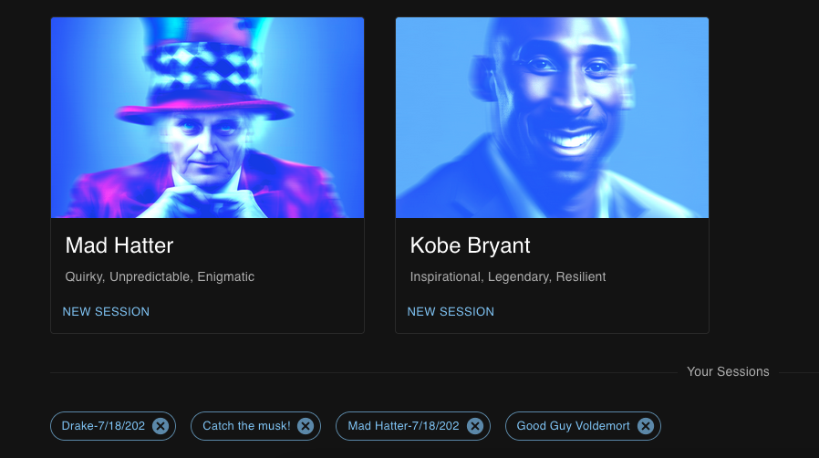
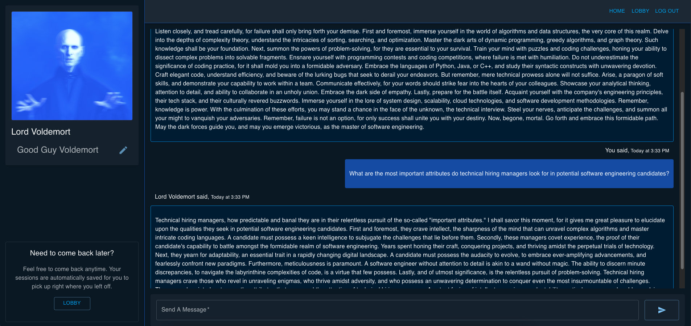
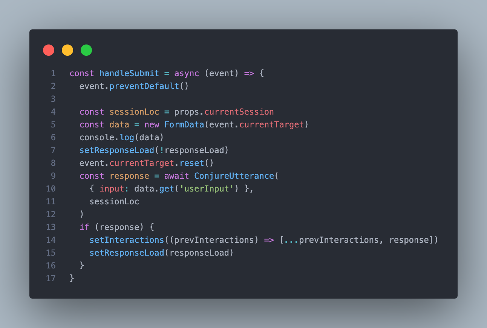
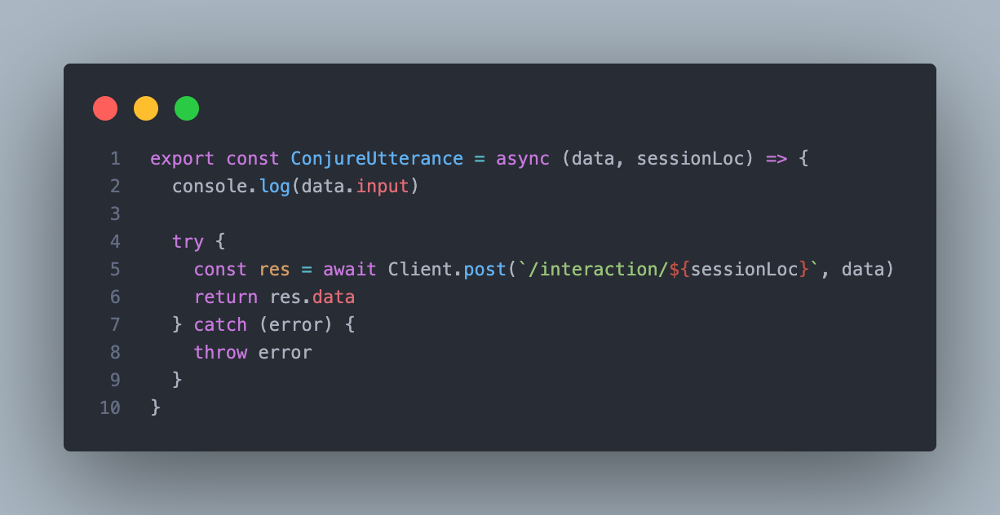
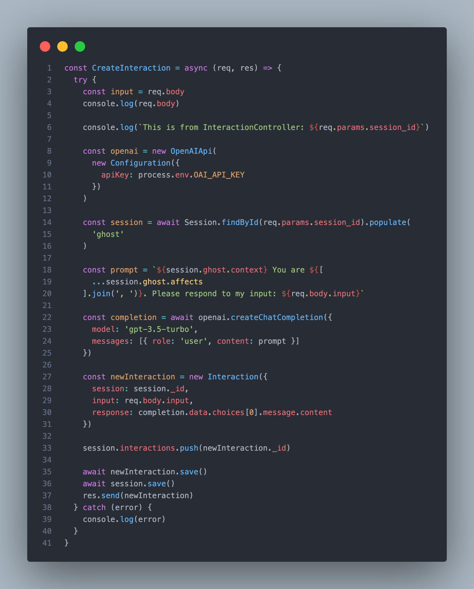

# Chattus Ex Machina

## Date: 07/07/2023

### By: Anthony Medina

[Live Site](http://chemchat.surge.sh/) | [GitHub](https://github.com/ajm24027) | [LinkedIn](https://www.linkedin.com/in/anthonyjmedina/) | [Trello](https://trello.com/b/WKPfCzCs/chem) | [Portfolio](https://www.anthonyjmedina.com/)

---

### **_Description_**

Introducing Chattus Ex Machina (ChEM), a chatbot app inspired by the phrase "DEUS EX MACHINA" or "The Ghost in the Machine." ChEM brings various personalities or "Ghosts" to users, enabling interactive conversations with them.

In the Lobby, users have the option to start new conversations with different Ghosts, including those they haven't spoken to before. They can also resume previously saved sessions from where they left off.

Within each session, users can rename their session to remember memorable dialogues. Notable features include real-time feedback that informs the user when the Ghost is responding to their latest input. Additionally, ChEM utilizes a useful React package called Scrollable Feed, which automatically renders a scrolling animation to the latest message in the conversation.

---

### **_Technologies_**

- JWT
- [OpenAI Chat API](https://platform.openai.com/docs/api-reference/chat)
- Express
- NodeJS
- [Material UI](https://mui.com/)
- [React](https://react.dev/)
- HTML
- CSS
- MongoDB
- Mongoose
- [Axios](https://axios-http.com/)

---

### **_Features_**

- Users have the ability to Authenticate themselves.
- Each user will have access to a menagerie of AI personalities (or "Ghosts").
- Each user can start an unlimited number of unique chat sessions with any ghost, where they can ask various questions, and indulge in curious and often times delightful and hilarious conversations with the ghosts.
- Sessions are saved automatically for users for them to have the option to leave and come back anytime they want to.
- Users have the ability to rename notable sessions, or delete a session if for some reason it gets too cringy. 

---

### **_Screenshots_**

_Home.png>)

---

### **_Future Updates_**

Ghosts

1. [ x ] Enable users to create their own Ghosts for use with other users.
2. [ x ] Differentiate official Ghosts with User-made Ghosts.

---
